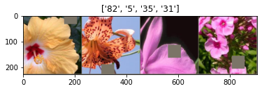
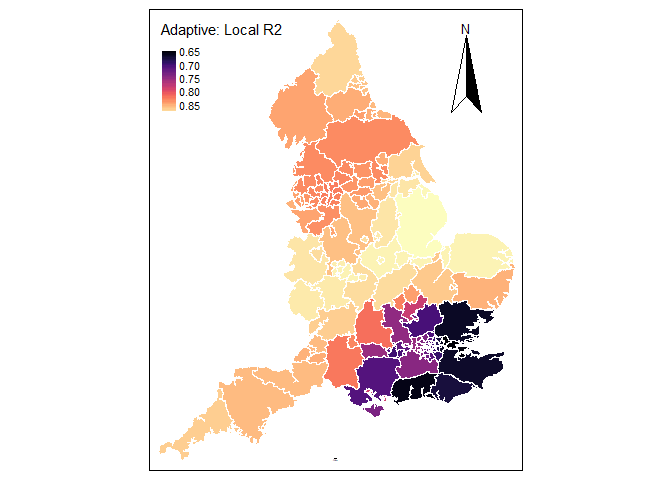
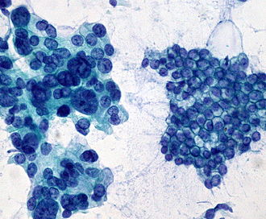

# Research

## Bayesian Framework for Analyzing Sparse Functional Data

Functional data assumes that the unit of analysis in function, typically curves or surfaces. In sparse functional data setting, curves are observed on different points and even different number of points for each subject. We have developed a Bayesian framework for analyzing such a data leveraging the power of Gaussian process. We have applied our model in different settings such as bone mineral density dataset (longitudinal study) and temporal gene expression data.

## Transfer learning for flower image classification

This project demonstrates the ability of transfer learning when the number of training instances is low. The Visual Geometry Group of Department of Engineering Science, University of Oxford created this data with 102 flower categories. The flowers chosen to be flower commonly occuring in the United Kingdom. Each class consists of between 40 and 258 images. Pre-trained Resnet 34 is applied on this flower image classification task.

[Google Colab Notebook](tahmid-usc.github.io/flower_clean)

## Spatial analysis of COVID-19 infection in UK

In this project with Fahim Ahmed (USC), we analyzed the spread of the COVID-19 in UK from spatial analysis perspective. The objective was to find COVID hotspots and further investigate the hypothesized existence of racial and ethnic disparity in the infected areas. We utilized geographically weighted regression (GWR) model for this analysis. 

## COVID-19 cases and deaths projection using Gaussian process regression with Richard’s curve prior

This is a small project to display the power of Gaussian process regression and incorportation of prior mean function. Details can be found here: https://tahmid-usc.github.io/covidGP

## Forecast electricity power load in Texas with TBATS model

We have used state space exponential smoothing model ('forecast' package in R) to forecast the power load in Texas. We have found that the statistical model performs better than LSTM deep learning model for this particular case.

 

## Breast cancer prediction from the FNA image
I have applied L1-regularized logistic regression model to predict breast cancer from the digitized image of fine needle aspirate (FNA) of breast mass.

